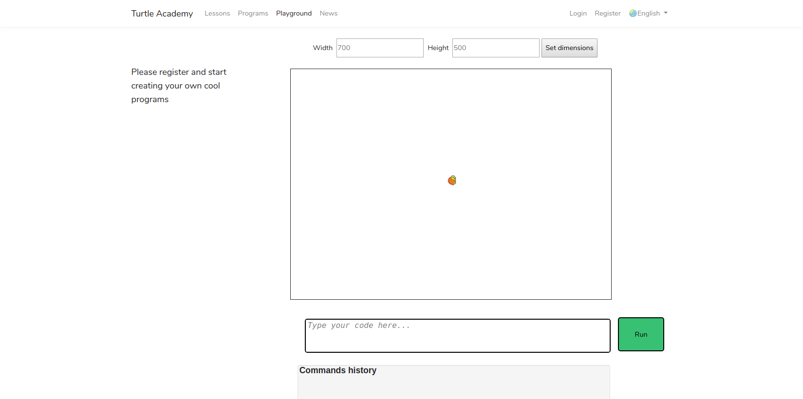
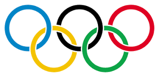
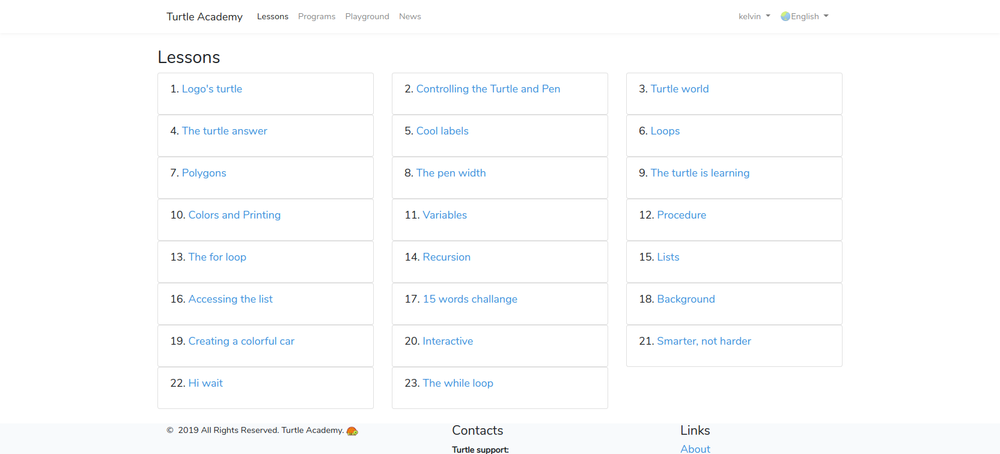
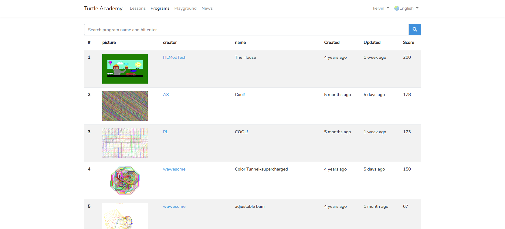

# 海龟作图 - Logo编程语言入门

## 介绍

### 什么是编程语言？

- 人用于控制计算机运行的一种“语言”
- 

### 有哪些编程语言？

- 机器语言：0000,0001,000000000001
- 汇编语言：mov eax, ebx
- 高级语言：Java、C、Python、C++、 MATLAB...
-  

### logo 语言
- 用于绘图
- 简单、易学

### 海龟学院

- 一个学习交流Logo语言的网站
- [网址 http://turtleacademy.com/](http://turtleacademy.com/)
- 

### 海龟学院-Playground
- 不用登录就可以运行Logo程序, 但不方便调试
- 


### 海龟学院注册
- 点击 register 注册
- 

### 海龟学院注册
- 输入 用户名， 邮箱， 密码, 进行注册，并验证邮箱
- 

### 海龟学院登录
- 输入 用户名或邮箱， 密码， 登录网站
- 

### 进入用户主页
- 点击用户名
- 

### 进入用户主页
- 点击 Profile
- 

### 进入编程界面
- 点击 Create new program
- 

### 编程界面
- 
- 海龟一开始时在屏幕中心，头朝上


### 零、Hello world!

- 正如刚开始学所有的编程语言一样


```
rt 90 
bk 120
setlabelheight 50
label [Hello World!]
```

- 这段代码的含义，让我们一起学习吧！


### 一、控制海龟的基本命令
> fd **步数** （前进 forward）

> bk **步数** （后退 back）

> lt **角度** （左转 left）

> rt **角度** （右转 right）

> cs （清屏并回到原位 clearscreen）

### 试一试：让小海龟画一个正方形

**边长可以指定为100 \ (注：Logo不区分大小写）**

> fd 前进, bk 后退, lt 左转, rt 右转

> cs 清屏并回到原位 


- **参考代码** 


- fd 100 rt 90 fd 100 rt 90 fd 100 rt 90 fd 100 rt 90 

### 试一试：让小海龟画一个等边三角形

**边长可以指定为100**

> fd 前进, bk 后退, lt 左转, rt 右转

> cs 清屏并回到原位 


- **参考代码** 


- fd 100 rt 120 fd 100 rt 120 fd 100 rt 120 

### 

- 要让三角形底边向下？ 让小海龟转一下方向
- rt 30 
- fd 100 rt 120 fd 100 rt 120 fd 100 rt 120 

### 画正五边形、正六边形...？ 先等等


### 学一学：几何知识

- 多边形的外角、外角和

- 对于一个封闭的凸多边形， 其外角和总是360度

- 如果小海龟要画凸多边形， 总共转过的角度是360度！ (例子：正方形，三角形）

### 

- 画正方形的代码 fd 100 rt 90 fd 100 rt 90 fd 100 rt 90 fd 100 rt 90 
- 写的重复的指令太多了？ 画五边形、六边形？

### 二、repeat循环
> repeat \ **重复次数** \ [**需要重复的指令**] 


- 将需要重复的指令重复运行

### 试一试：用repeat指令画正三角形、正方形

> repeat \ **重复次数** \ [**需要重复的指令**] 
 

- **参考代码** 

- 正三角形 repeat 3 [fd 100 rt 120]
- 正方形 repeat 4 [fd 100 rt 90]
- 正n边形?
- repeat n [fd 边长 rt 360/n]

### 试一试：repeat画正n边形

- 如果小海龟跑出了边界，将边长放小一点

- n 不断增加， 你发现了什么？


### 另一种画圆的方式
> arc 360 半径


- 半圆
- arc 180 半径
- 一段弧长
- arc 角度 半径


###  试一试：用repeat 画五角星

-  repeat 5 [fd 100 rt 144]
- 让五角星正立？
-  rt 18 repeat 5 [fd 100 rt 144]

### 只能一笔画？
- 当然不是   

### 三、pu提笔、pd放笔 

> pu （提笔 penup）

> pd （提笔 pendown）


### 四、home 让小海龟回家

> home （回到初始位置，但不清屏）


- 一般和 pu pd 配合使用，防止在回家途中画画，弄乱其他图形
- pu home pd
- 试一试： 画不同图形的组合


### 想给图形上颜色？


### 五、用 filled 填充颜色
> filled  \ **填充颜色** \ [**需填充的图形的代码**] 


- 填充颜色: 颜色代号 或 "颜色英文名称   

- 如： filled 6 [rt 18 repeat 5 [fd 100 rt 144]]
-  filled "yellow [rt 18 repeat 5 [fd 100 rt 144]]

- 试一试其他图形

### 六、setcolor 改变线的颜色
> setcolor \ **线的颜色** \


- 颜色: 颜色代号 或 "颜色英文名称 或 rgb颜色代码（初始时为黑色）

- rgb 颜色 <http://tool.oschina.net/commons?type=3>

- 如： setcolor "red repeat 4 [fd 100 rt 90] 


### 七、setwidth 改变线的粗细
> setwidth \ **线的宽度** \


- 线的宽度: 初始时为1
- 如： setwidth 20 repeat 4 [fd 100 rt 90] 


### 试一试：画奥运五环
- 
- 提示: 要用 arc、 pu、 pd、home、setcolor 

### 试一试：画奥运五环

```
setwidth 10

arc 360 50 

pu lt 90 fd 120 rt 90 pd
setcolor "blue
arc 360 50 
pu home pd

pu rt 90 fd 120 lt 90 pd
setcolor "red
arc 360 50 
pu home pd

pu lt 135 fd 80 pd
setcolor "yellow
arc 360 50 
pu home pd

pu rt 135 fd 80 pd
setcolor "green
arc 360 50 
pu home pd
```


### 八、用fill填充 (可填充背景)
- 先用setcolor 设定\ **线的颜色** \


> fill （填充）


- 注意：若在闭合图形里，则填充图形，否则填充背景。在边上不填充


- repeat 4 [fd 100 rt 90] rt 45 fd 10 setcolor "red fill home

### 九、label 标签
> label [想显示的文字]


> setlabelheight  **标签的高度** (显示文字的大小)


- 文字的方向位于小海龟的朝向
- rt 90 label [Hello World!]


### 代码还能更简洁吗？
- 可以，但可能会有些难


### 十、函数
> to 函数名 :输入参数名 函数语句 end


- 输入参数可以没有
- 画一个边长为100的正方形
- to square repeat 4 [fd 100 rt 90] end
- square


### 十、函数
> to 函数名 :输入参数名 函数语句 end


- 也可以添加参数，注意参数前要加冒号
- 画一个边长为输入值的正方形
- to square :size repeat 4 [fd :size rt 90] end
- square 50
- square 100

### 试一试：画天文台的台标
- 将下面的代码复制到程序框之中

```
to shao :radius :sides 

  make "semisides :sides/2
  make "edge difference :semisides :radius
  
  filled "blue 
  [
  lt 90
  arc 180 :radius
  home
  ]

  filled "cyan
  [
  rt 90
  arc 180 :radius
  home
  ]

  pu lt 90 fd :radius pd 
  fd :edge rt 90 
  fd :semisides rt 90 
  fd :sides rt 90
  fd :semisides rt 90
  fd :edge rt 90
  
  pu 
  fd :edge 
  setcolor "cyan fill bk :edge rt 90
  pd
  
  fd :edge rt 90
  fd :semisides rt 90 
  fd :sides rt 90
  fd :semisides rt 90
  fd :edge rt 90
  
  pu
  fd :edge
  setcolor "blue fill bk :edge rt 90
  pd
 
end

make "sides_ 400
make "radius_ 150

shao :radius_ :sides_ 

setcolor 0
home
pu bk 260
rt 90 back 240
setlabelheight 50 label "中国科学院上海天文台
pd 
hideturtle
```

### hideturtle 让小海龟隐身
> ht （让小海龟隐身 hideturtle）


> st （让小海龟出现 showturtle）

### 接下来？
- 重点讲了一些命令，其余靠大家自学了
- 海龟学院的课程

- 


### 接下来？
- 别人的作品
- 


### 还想提高？更专业？

- [Logo 15-word challenge](http://www.mathcats.com/gallery/15wordcontest.html)


- 书籍：turtle geometry  <https://mitpress.mit.edu/books/turtle-geometry>


### 创作时间
- 发挥想象力，创作自己的海龟绘图作品