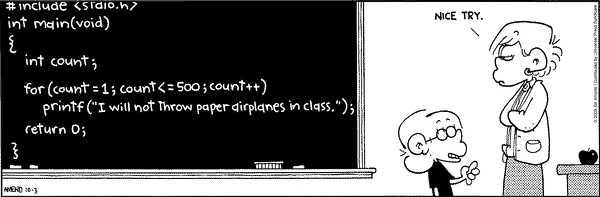
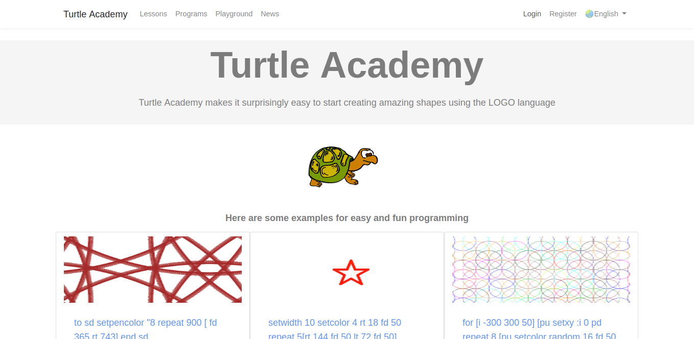

# 海龟做图 - Logo编程语言入门

## 介绍

### 什么是编程语言？

- 人用于控制计算机运行的一种“语言”
- 

### 有哪些编程语言？

- 机器语言：0000,0001,000000000001
- 汇编语言：mov eax, ebx
- 高级语言：Java、C、Python、C++、 MATLAB...
-  

### logo 语言
- 用于绘图
- 简单、易学

### 海龟学院

- 一个学习交流Logo语言的网站
- [网址 http://turtleacademy.com/](http://turtleacademy.com/)
- 

### 海龟学院注册

