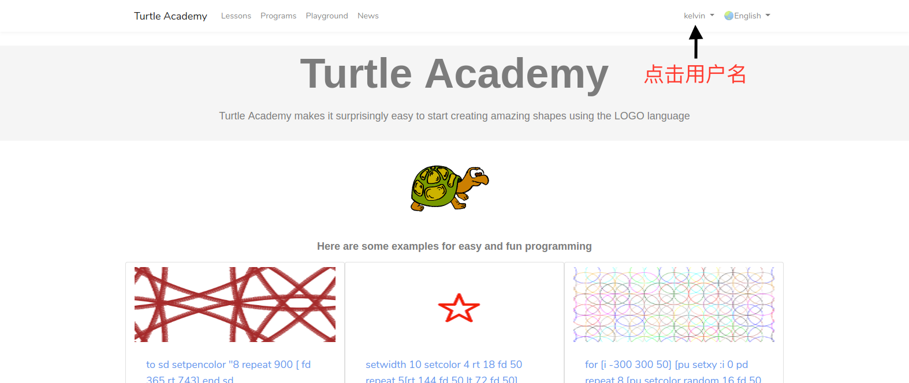

# 海龟做图 - Logo编程语言入门

## 介绍

### 什么是编程语言？

- 人用于控制计算机运行的一种“语言”
- 

### 有哪些编程语言？

- 机器语言：0000,0001,000000000001
- 汇编语言：mov eax, ebx
- 高级语言：Java、C、Python、C++、 MATLAB...
-  

### logo 语言
- 用于绘图
- 简单、易学

### 海龟学院

- 一个学习交流Logo语言的网站
- [网址 http://turtleacademy.com/](http://turtleacademy.com/)
- 

### 海龟学院注册
- 点击 register 注册
- 

### 海龟学院注册
- 输入 用户名， 邮箱， 密码, 进行注册
- 

### 海龟学院登录
- 输入 用户名或邮箱， 密码， 登录网站
- 

### 进入用户主页
- 点击用户名
- 

### 进入用户主页
- 点击 Profile
- 

### 进入编程界面
- 点击 Create new program
- 

### 编程界面
- 
- 海龟一开始时在屏幕中心，头朝上

### 一、控制海龟的基本命令
> FD **[步数]** （前进 forward）

> BK **[步数]** （后退 back）

> LT **[角度]** （左转 left）

> RT **[角度]** （右转 right）

> CS （清屏并回到原位 clearscreen）

### 试一试：让小海龟画一个正方形

> FD 前进, BK 后退, LT 左转, RT 右转

> CS 清屏并回到原位 

### 二、循环

